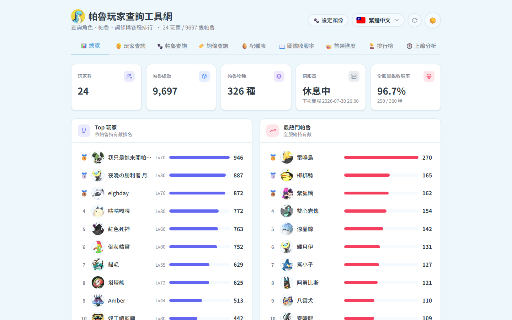

[繁體中文](README.md) | **English** | [简体中文](README.zh-CN.md) | [日本語](README.ja.md)

# 🐏 Palworld Player Lookup (all-in-one server suite)

**Double-click one file and you get a complete Palworld dedicated server**, plus a lookup website your players can open in any browser:



- 🖥️ Palworld dedicated server (community Docker image)
- ⏰ Automatic open/close scheduler (time windows, shutdown countdown broadcasts, crash auto-restart)
- 🌐 Player lookup website: Dashboard / Players / Pals / Traits / **Breeding** / Paldex / Bosses / Rankings / Online activity
- 🥚 Breeding tools: full coverage of 299 breedable pals × 44,851 recipes, interactive **breeding tree** and **shortest-path** planner, player-view owned/missing markers
- 🌍 Website UI in 4 languages (Traditional Chinese / Simplified Chinese / English / Japanese)

📖 **[Full user manual with screenshots](docs/manual.html)** · screenshot gallery: [docs/screenshots/](docs/screenshots/)

---

## 🚀 Start a server in 3 steps (no commands required)

1. **Install Docker**
   - Windows: install and start [Docker Desktop](https://www.docker.com/products/docker-desktop/)
   - Linux: `curl -fsSL https://get.docker.com | sh`
2. **Download this project**: green `Code` button → `Download ZIP` → extract (or `git clone`)
3. **Launch**
   - Windows: double-click **`start.bat`**
   - Linux/macOS: `./start.sh`

The first launch **generates all configuration and two random passwords automatically** (shown in the console — write them down), then pulls the images and starts all four services:

| Service | Address |
|---|---|
| Lookup website | `http://localhost` (or `http://your-host-ip`) |
| Game connection | `your-host-ip:8211` (UDP) + the join password shown on first run |

## 🕹️ Day-to-day operation (just double-click)

| Action | Windows | Linux/macOS |
|---|---|---|
| Start everything | `start.bat` | `./start.sh` |
| Restart (apply new settings) | `restart.bat` | `./restart.sh` |
| Stop everything | `stop.bat` | `./stop.sh` |
| Status / logs | `status.bat` | `./status.sh` |

Prefer a single executable? Install [Go](https://go.dev/dl/), then `cd tools/launcher && go build -o ../../palserver.exe .` — double-click `palserver.exe` for a numbered menu (start / restart / stop / status / rebuild website).

## 🎛️ Tune the server by editing ONE file: `.env`

**Every** Palworld parameter (name, player cap, passwords, EXP/capture/damage rates, egg hatching time, PvP… ~50 options) lives in `.env` at the project root. Each option is documented in English in [`.example.env`](.example.env). Save your changes, then double-click `restart.bat`:

```env
SERVER_NAME=My Palworld Server
PLAYERS=32
EXP_RATE=1.0          # experience multiplier
PAL_CAPTURE_RATE=1.0  # capture rate multiplier
PAL_EGG_DEFAULT_HATCHING_TIME=72.0  # hours to hatch
```

> `.env` is git-ignored — your passwords never leave your machine. Anything you omit falls back to a sane default.

## 🚚 Painless migration: bring your existing save

The whole system reads exactly one location: `backend/palworld-data/`. Copy your world folder in and the website instantly shows YOUR server's players, pals and rankings:

```text
backend/palworld-data/Pal/Saved/SaveGames/0/<YourWorldGUID>/   ← drop the whole folder here
    ├── Level.sav        (world save)
    ├── LevelMeta.sav
    └── Players/*.sav    (one per player)
```

1. Stop both servers first (`stop.bat`)
2. Source location: Windows dedicated server `PalServer\Pal\Saved\SaveGames\0\<GUID>`; same layout on Linux/Docker
3. Copy the whole `<GUID>` folder into the path above
4. Linux hosts: `sudo chown -R 1000:1000 backend/palworld-data`
5. `start.bat`, then hit 🔄 in the website header

> ⚠️ Never edit `PalWorldSettings.ini` directly — it is regenerated from `.env` on every boot.

## ⏰ Schedule & broadcasts: `backend/config.json`

Open/close time windows and shutdown countdown messages live here (auto-generated on first run; see `config.example.json`):

| Field | Meaning |
|---|---|
| `schedule.windows` | Opening-hours table — **full rules in the subsection below** |
| `hooks.onClose.announce` | Pre-shutdown broadcasts: `{ "at": 600, "message": "Closing in 10 minutes" }` — edit just this array |
| `api.token` | API password used by the website backend (randomly generated) |

Apply with `docker compose restart scheduler` (or simply `restart.bat`).

### `schedule.windows` in full (opening-hours table)

Each entry is one "open window"; you may list several:

```json
"windows": [
  { "label": "weekday-night", "days": ["Mon","Tue","Wed","Thu","Fri"], "open": "19:00", "close": "23:30" },
  { "label": "weekend",       "days": ["Sat","Sun"],                   "open": "10:00", "close": "03:00" }
]
```

| Field | Rules |
|---|---|
| `label` | Free-form note; no effect on behaviour |
| `days` | Which **opening days** the window applies to. Accepts `Mon`/`Tue`/`Wed`/`Thu`/`Fri`/`Sat`/`Sun` or full English names (`Monday`), case-insensitive |
| `open` / `close` | `"HH:MM"`, hours **0-23**, minutes 0-59 (⚠️ `24:00` is NOT valid) |

**Behaviour:**

- `close` ≤ `open` ⇒ closing time falls on the **next day**: `Sat 10:00 → 03:00` = opens Saturday 10 am, closes Sunday 3 am
- For windows crossing midnight, list only the opening day in `days`
- Multiple windows may overlap and a day may have several windows (morning + evening); the union applies
- **24/7 operation**: list all seven days with `"open": "00:00", "close": "00:00"` (close = open counts as next day, i.e. a full 24 h)
- To keep a day fully closed (e.g. Wednesday maintenance): simply omit `Wed` from every window's `days`
- All times use the `TZ` timezone from `.env`
- At `open` the scheduler runs `hooks.onOpen` (start container + welcome broadcast); at `close` it runs `hooks.onClose` (countdown broadcasts → save → shutdown) with the countdown **ending exactly at** the close time
- Manual override anytime: `POST /api/open`, `/api/close` act immediately; `/api/resume` hands control back to the schedule (all require `api.token`)

## 🔄 Refresh breeding data after game updates (optional)

```bash
cd frontend
node scripts/fetch-palcalc-breeding.mjs   # recipes
node scripts/fetch-pal-meta.mjs           # elements / paldex no. / rarity
pnpm build && cd .. && docker compose up -d --no-deps --build panel
```

## 🧱 No Docker? SteamCMD native mode

Machines that can't run Docker can still host the game server with the scripts in [`native/`](native/README.md):

1. Double-click `native\windows\install.bat` (auto-downloads SteamCMD + the server)
2. Double-click `native\windows\start.bat` (Linux: `./install.sh` then `./start.sh`)
3. Edit settings in `native/server/Pal/Saved/Config/.../PalWorldSettings.ini` (never overwritten in native mode)

Native mode covers install/start/stop/update of the game server; the lookup website and the scheduler still require Docker.
**Saves are fully interchangeable** - to upgrade later, move your world folder into `backend/palworld-data/` (see [native/README.md](native/README.md)).

## ❓ FAQ

| Problem | Fix |
|---|---|
| Website shows no players | Save not in the right folder (see migration), or the server never ran; then hit 🔄 |
| Scheduler didn't open the server | Check `TZ` in `.env` and `schedule.windows` in `config.json`; `status.bat` for logs |
| Forgot the passwords | They're in plain text in `.env`; change and `restart.bat` |
| Port already in use | Change the left side of the port mappings (80 / 8211 / 9000) in the compose files |

## License & credits

- Breeding recipes: [tylercamp/palcalc](https://github.com/tylercamp/palcalc) (MIT)
- Elements / rarity: [oMaN-Rod/palworld-save-pal](https://github.com/oMaN-Rod/palworld-save-pal)
- Server image: [thijsvanloef/palworld-server-docker](https://github.com/thijsvanloef/palworld-server-docker)
- Other data sources: `frontend/packages/web/public/game-data/CREDITS.md`
