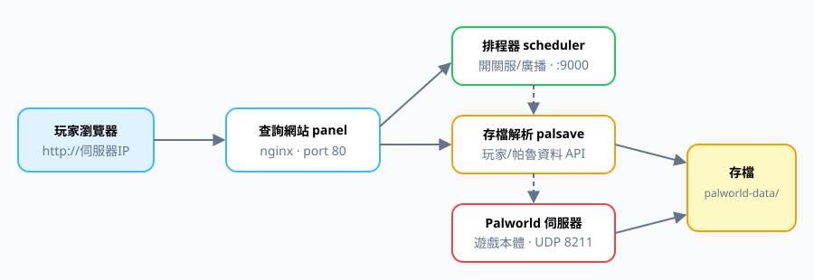

# 🐏 帕魯玩家查詢工具網 Wiki

一套 **Docker 一鍵部署**的 Palworld 伺服器全家桶:遊戲伺服器 + 自動排程開關服 + 玩家查詢網站。
本 Wiki 是完整使用手冊 —— 每個分頁、每個子功能都有截圖與操作步驟。

## 🚀 我要開服(服主看這裡)

| 頁面 | 內容 |
|---|---|
| [[安裝與一鍵啟動]] | 三步驟開服、日常 start/stop 腳本、Go 選單啟動器 |
| [[伺服器參數 .env]] | 約 50 個 Palworld 參數,改一個檔就重佈署 |
| [[排程與廣播 config.json]] | 開服時段表完整規則、關服倒數廣播、API 手動接管 |
| [[存檔搬家]] | 把既有伺服器存檔無痛搬進來/搬出去 |
| [[SteamCMD 原生模式]] | 沒有 Docker 也能開遊戲伺服器 |

## 🌐 網站功能(玩家看這裡)

| 分頁 | 頁面 |
|---|---|
| 📊 總覽 | [[網站-總覽]] |
| 🧑 玩家查詢 | [[網站-玩家查詢]] |
| 🐾 帕魯查詢 | [[網站-帕魯查詢]] |
| 🏷️ 詞條查詢 | [[網站-詞條查詢]] |
| 🥚 配種表(招牌) | [[網站-配種表]] |
| 📖 圖鑑收服率 | [[網站-圖鑑收服率]] |
| 👑 首領進度 | [[網站-首領進度]] |
| 🏆 排行榜 | [[網站-排行榜]] |
| 🕐 上線分析 | [[網站-上線分析]] |

遇到問題先看 [[FAQ]]。
