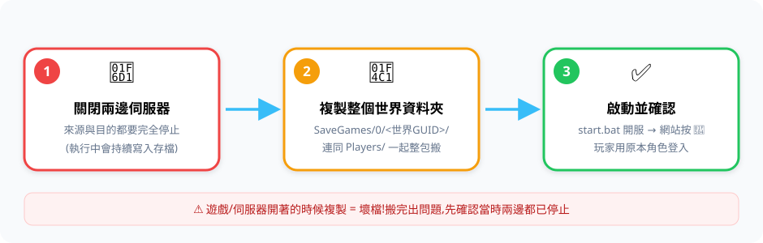
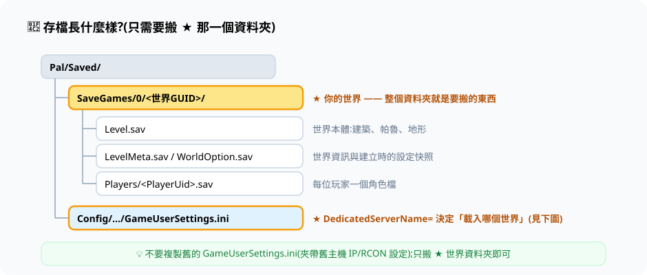
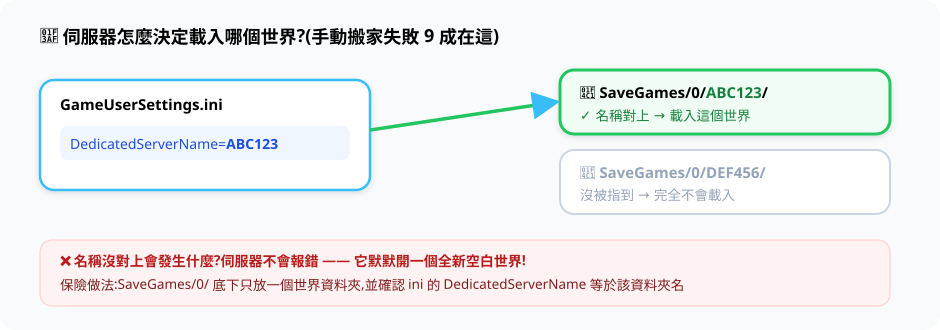
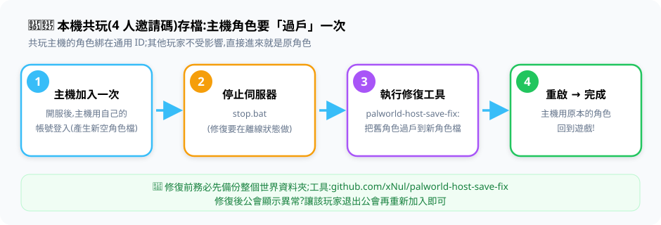

# 🚚 存檔搬家

> 三張圖看懂搬家;細節與特殊情況在圖下方。



## 存檔的結構



系統只讀一個位置:`backend/palworld-data/`。要搬的就是 ★ 那個世界資料夾:

```text
backend/palworld-data/Pal/Saved/SaveGames/0/<世界GUID>/
```

## 來源在哪裡找

| 來源 | 存檔位置 |
|---|---|
| 其他 Windows 專用伺服器 | `PalServer\Pal\Saved\SaveGames\0\<GUID>` |
| 其他 Linux / Docker 伺服器 | 掛載目錄下同層級 |
| **本機共玩存檔(4 人邀請碼)** | `%LOCALAPPDATA%\Pal\Saved\SaveGames\<SteamID>\<GUID>` |
| 本專案的 [[SteamCMD 原生模式]] | `windows/native/server/Pal/Saved/SaveGames/0/<GUID>` |

## 搬家步驟

1. **兩邊伺服器都完全停止**(`windows\stop.bat`;共玩來源=關閉遊戲)
2. 複製整個 `<GUID>` 資料夾到 `backend/palworld-data/Pal/Saved/SaveGames/0/`
3. Linux 主機:`sudo chown -R 1000:1000 backend/palworld-data`
4. `windows\start.bat` 啟動 → 網站右上 🔄 重新載入

## ⚠️ 為什麼有時搬完變「全新世界」?



伺服器是靠 `Config/.../GameUserSettings.ini` 裡的 `DedicatedServerName=` 找世界,不是「看到資料夾就載入」。
保險做法:`SaveGames/0/` 底下**只放一個世界資料夾**;若載入到空世界,打開 ini 把 `DedicatedServerName` 改成你的 GUID 資料夾名再重啟。
另外**不要**複製舊伺服器的 `GameUserSettings.ini` 整檔(夾帶舊 IP/RCON 設定)。

## 🧑‍🔧 本機共玩存檔:主機角色修復



只有「主機本人」需要這一步(角色綁在通用 ID);其他成員直接登入就是原角色。
修復工具:[palworld-host-save-fix](https://github.com/xNul/palworld-host-save-fix)(主路徑 `guild_fix=False`),執行前先備份整個世界資料夾。

## 與 [[SteamCMD 原生模式]] 互搬

| 方向 | 從 | 到 |
|---|---|---|
| 原生 → Docker | `windows/native/server/Pal/Saved/SaveGames/0/<GUID>` | `backend/palworld-data/Pal/Saved/SaveGames/0/` |
| Docker → 原生 | `backend/palworld-data/.../0/<GUID>` | `windows/native/server/Pal/Saved/SaveGames/0/` |

## 搬完檢查清單

- [ ] 世界大小合理(空世界通常 <1 MB;玩過的幾十 MB 起跳)
- [ ] 玩家能用原本角色登入
- [ ] 網站 🔄 後看得到大家的帕魯
- [ ] 順手備份一份 `<GUID>` 資料夾

> 遊戲性設定不在存檔裡:Docker 模式改 `.env`(見 [[伺服器參數 .env]]);原生模式改 `PalWorldSettings.ini`。
