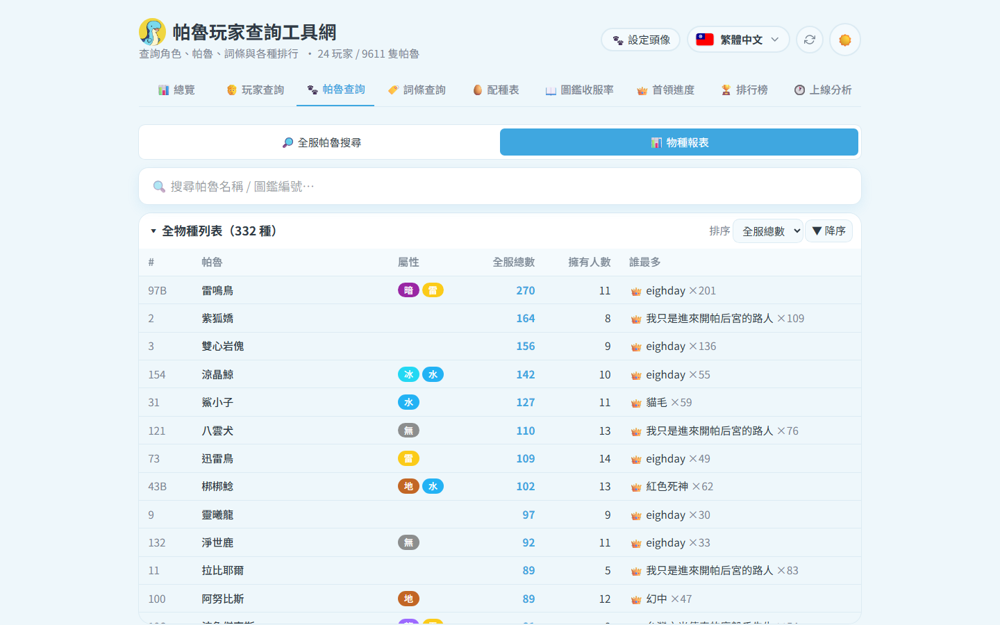

# 🐾 帕魯查詢

兩種模式(左上切換):**全服帕魯搜尋** 與 **物種報表**。

## 🔎 全服帕魯搜尋

- 多重過濾:名稱、屬性、被動詞條(且/或)、星級 ★、性別、工作適性、IV 門檻、等級、α/稀有、特別取名、擁有者
- 排序:綜合戰力 / 等級 / 個體值總和 / 各單項 IV / 工作效率 / 好感度 / 名稱
- 每張卡顯示擁有者;點卡開帕魯詳情

## 📊 物種報表

- 每個物種:全服總數、擁有人數、👑 誰抓最多
- 排序:全服總數 / 擁有人數 / 名稱 / 圖鑑編號
- 點一列 → 展開該物種詳情:各玩家持有長條圖 + 全部個體卡片
