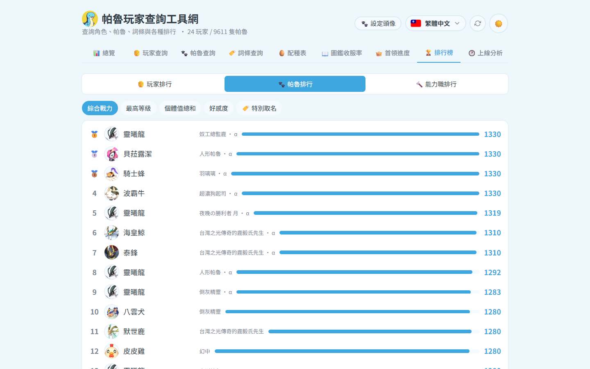

# 🏆 排行榜

三大區塊(上方切換):🧑 玩家排行 / 🐾 帕魯排行 / 🔨 能力職排行。

## 🧑 玩家排行

指標:圖鑑收服達成率、圖鑑收服數、等級、經驗值(遊戲時數參考)、帕魯總數、完美個體(IV 300)數、α/首領收集、被動詞條大師、稀有帕魯收集。
點任一玩家 → 直接開啟他「該指標對應」的帕魯清單(預先套用篩選)。

## 🐾 帕魯排行

指標:綜合戰力、最高等級、個體值總和、好感度、🏷️ 特別取名(有暱稱的帕魯,支援依玩家/戰力/等級/暱稱排序與搜尋)。

## 🔨 能力職排行

13 種工作適性(點火/採礦/搬運…)各自的最強工人排行,與「工人數排行(玩家)」。
