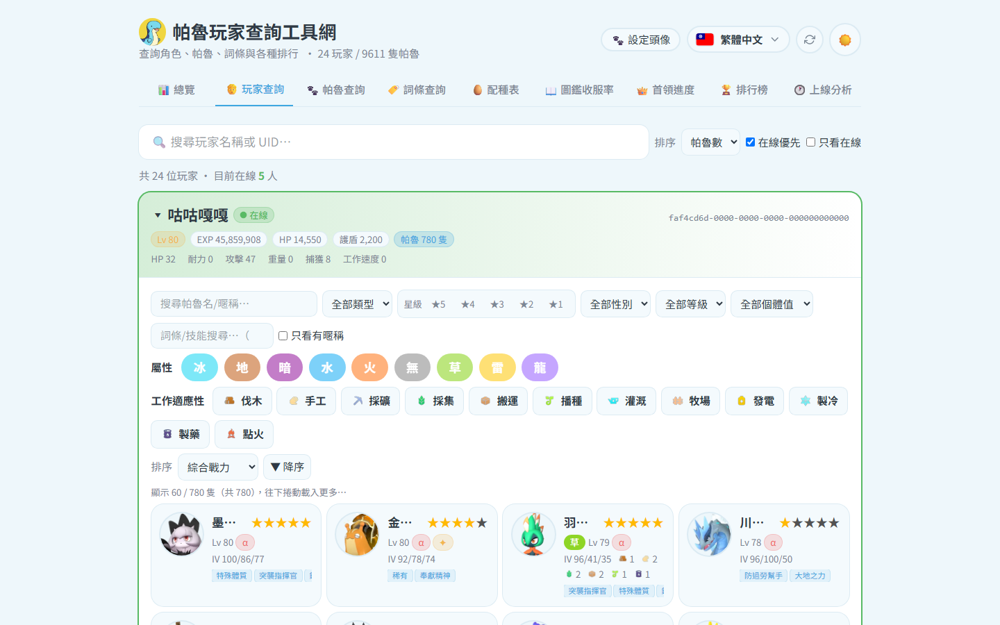

# 🧑 玩家查詢

搜尋玩家,查看他的全部帕魯與統計。

## 操作

1. 搜尋框輸入玩家名稱(部分比對),或直接瀏覽玩家卡片
2. 排序:帕魯數 / 等級 / 經驗 / 圖鑑數
3. **點玩家卡 → 詳情彈窗**:

- 統計磚:等級、帕魯總數、經驗值、圖鑑物種、完美個體(IV 300)、α/首領種、不重複被動、稀有
- 帕魯清單依綜合戰力排序;**點帕魯卡**看個體值(HP/攻/防 IV 條)、星級、被動詞條、已學技能
- 點詞條/工作適性可反向跳到 [[網站-帕魯查詢]] 預先套用篩選
