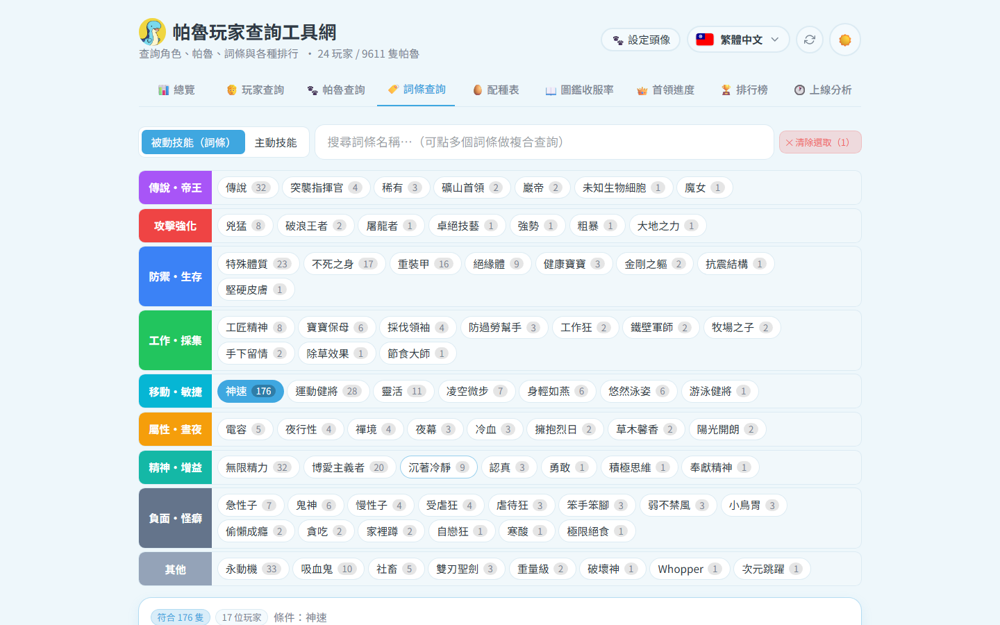

# 🏷️ 詞條查詢

用被動詞條(或主動技能)反查全服哪些帕魯符合 —— 配種素材蒐集神器。

## 操作

1. 詞條依分類分層顯示(傳說・帝王/攻擊強化/防禦・生存/工作・採集/移動・敏捷/屬性・晝夜/精神・增益/負面・怪癖),左側色塊即分類
2. 點詞條加入條件(可多選);**且 / 或** 切換組合邏輯
3. 結果:符合隻數、每位玩家擁有數長條;點玩家展開他符合的帕魯卡片
4. 也可切到「主動技能」分頁,用技能(依屬性分組)反查
