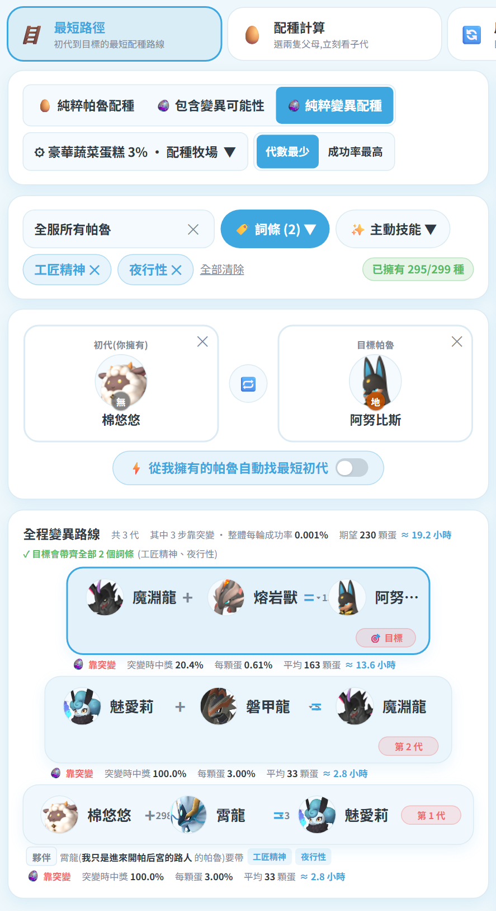

# 🏷️ 詞條篩選配種

在「🥚 配種表 → 🪜 最短路徑」裡,可以指定**要帶到目標身上的詞條**,
系統會用現有的帕魯排列組合,算出把這些詞條全部帶過去的路線。
**三種配種來源(純直系 / 包含變異 / 純變異)都吃這個篩選**,而且都是硬條件 ——
帶不到就直接說配不出來,詳見下方〈與變異模式的關係〉。

## 怎麼用

1. 先選好**目標帕魯**
2. 按 **🏷️ 詞條** 或 **✨ 主動技能** 下拉,最多複選 **4 個**(兩者合計)
   - 每個選項後面的 `×N` 是範圍內有幾隻帕魯帶著它
   - **劃線反灰**的代表:帶這個詞條的帕魯都配不到目標,選了也沒用
3. 系統開始運算(跑在背景執行緒,計算期間畫面照常可以操作)

## 繼承規則

子代會繼承**雙親詞條的聯集**,所以父母各帶一部分就好:

- ✅ 父 2 個 + 母 2 個 = 4 個
- ✅ 父 1 個 + 母 3 個 = 4 個
- ❌ 不需要單一一隻同時帶滿 4 個

梯度上每一列都會標出**雙親各自帶了哪些詞條**,一眼看出來源。

## 梯度上能做什麼

| 動作 | 說明 |
|---|---|
| 點**葉端帕魯** | 換成同物種、同性別、詞條涵蓋相同的其他個體(顯示暱稱/等級/主人) |
| 點**葉端帕魯 → 跨物種區塊** | 換成其他物種中帶該詞條的帕魯,整條路線與代數會重算 |
| 點**中間代帕魯** | 顯示說明:牠是配種結果,詞條會自動遺傳,你不需要已擁有帶詞條的牠 |
| 點**目標列** | 換一隻目標,路線重算 |

## 玩家視角

左上的下拉可切換範圍:

- **全服所有帕魯** —— 用整個伺服器的帕魯排列組合
- **某位玩家** —— 只用那位玩家的帕魯(適合規劃自己配得出來的路線)
- **全部帕魯種類** —— 不看誰有,純看理論可行性

## 與變異模式的關係

切到「包含變異可能性」或「純粹變異配種」時,詞條篩選一樣有效,而且**只會出現一組梯度卡片**
(不會純配種與變異兩組同時列出)。

**詞條是硬條件,不是加分項**:解算器把「還缺哪些詞條」一起放進搜尋狀態,
只有能把選定詞條**全部送到目標身上**的路線才會被列出來。
所以標題永遠是 `✓ 目標會帶齊全部 N 個詞條` —— 沒有「只帶到 1/4」這種半套結果。
真的做不到時,畫面會直接說**配不出來**,並告訴你卡在哪裡。

### 每一步都標明「誰要出這隻」

| 畫面上會看到 | 意思 |
|---|---|
| `初代 鬼刃武士(貓毛 的帕魯)要帶 工匠精神` | 初代要用**貓毛**這位玩家那隻帶「工匠精神」的鬼刃武士 |
| `夥伴 霄龍(阿東 的帕魯)要帶 夜行性 社畜` | 這一步的夥伴要用**阿東**那隻,牠負責補這兩個詞條 |
| 沒有標示的一列 | 這一步不需要新的詞條,雙親自己帶上來就夠 |

也就是說,你可以直接看出**全服有誰持有帶該詞條的帕魯**,能不能借到就是談判問題了。
初代候選清單也只會列出「真的有人擁有、且帶得動所需詞條」的物種。

換夥伴時,清單只會留下**同樣帶得動這一步所需詞條**的帕魯 —— 換了也不會把保證弄丟。

### 全程變異也能帶詞條

上圖:三步全靠突變,詞條在第 1 代由某位玩家的霄龍帶進來,一路繼承到阿努比斯。

### 突變的硬上限:一次只帶得動 2 個詞條

突變蛋的四格被動裡,**固定有兩格是彩虹詞條,只剩兩格繼承父母**,
所以任何一次突變最多只能把 **2 個**指定詞條帶給子代。

推論(系統會自動套用):

- **純粹變異配種**:最後一步必定是突變 → 選超過 2 個詞條時**必定無解**
- **包含變異可能性**:只要最後一步走直系,4 個詞條照樣帶得到目標

選了 4 個詞條又切到純變異時,畫面會直接說明原因與解法:

## 找不到路線時

會顯示原因與建議:減少詞條數量、擴大玩家視角範圍,或先取得帶有這些詞條的帕魯。
若你有指定初代而導致無解,也會提示可以改成清單中的其他初代。
