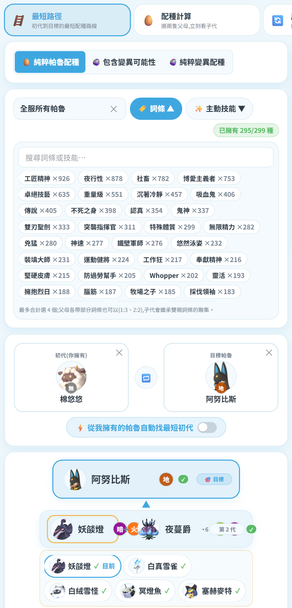
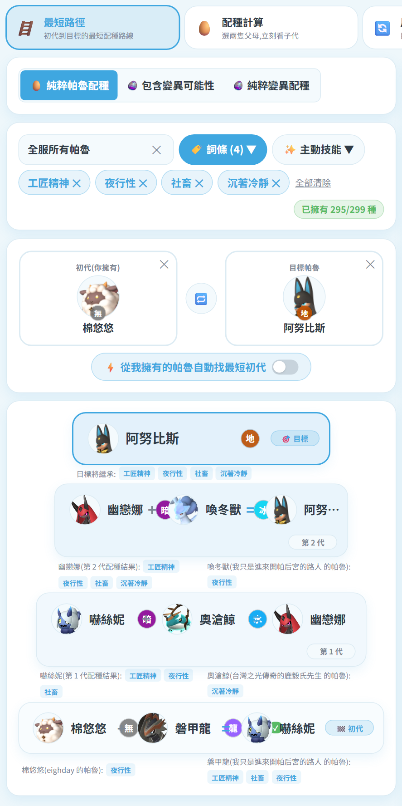
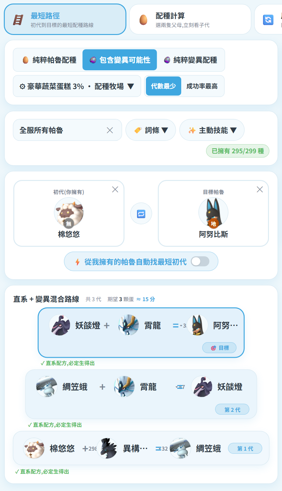

# 🏷️ 詞條篩選配種

在「🥚 配種表 → 🪜 最短路徑 → 純粹帕魯配種」裡,可以指定**要帶到目標身上的詞條**,
系統會用現有的帕魯排列組合,算出把這些詞條全部帶過去的路線。

## 怎麼用

1. 先選好**目標帕魯**
2. 按 **🏷️ 詞條** 或 **✨ 主動技能** 下拉,最多複選 **4 個**(兩者合計)
   - 每個選項後面的 `×N` 是範圍內有幾隻帕魯帶著它
   - **劃線反灰**的代表:帶這個詞條的帕魯都配不到目標,選了也沒用
3. 系統開始運算(跑在背景執行緒,計算期間畫面照常可以操作)

## 繼承規則

子代會繼承**雙親詞條的聯集**,所以父母各帶一部分就好:

- ✅ 父 2 個 + 母 2 個 = 4 個
- ✅ 父 1 個 + 母 3 個 = 4 個
- ❌ 不需要單一一隻同時帶滿 4 個

梯度上每一列都會標出**雙親各自帶了哪些詞條**,一眼看出來源。

## 梯度上能做什麼

| 動作 | 說明 |
|---|---|
| 點**葉端帕魯** | 換成同物種、同性別、詞條涵蓋相同的其他個體(顯示暱稱/等級/主人) |
| 點**葉端帕魯 → 跨物種區塊** | 換成其他物種中帶該詞條的帕魯,整條路線與代數會重算 |
| 點**中間代帕魯** | 顯示說明:牠是配種結果,詞條會自動遺傳,你不需要已擁有帶詞條的牠 |
| 點**目標列** | 換一隻目標,路線重算 |

## 玩家視角

左上的下拉可切換範圍:

- **全服所有帕魯** —— 用整個伺服器的帕魯排列組合
- **某位玩家** —— 只用那位玩家的帕魯(適合規劃自己配得出來的路線)
- **全部帕魯種類** —— 不看誰有,純看理論可行性

## 找不到路線時

會顯示原因與建議:減少詞條數量、擴大玩家視角範圍,或先取得帶有這些詞條的帕魯。
若你有指定初代而導致無解,也會提示「清除初代或換一隻」。

## 與變異模式的關係

切到「包含變異可能性」或「純粹變異配種」時,詞條篩選仍然有效,而且**只會出現一組梯度卡片**
(不會純配種與變異兩組同時列出)。

因為詞條只能從**初代**帶上去,所以初代候選會自動限定成
「全服中真的有人擁有、且帶有所選詞條」的物種,帶越多所選詞條的排越前面。

| 畫面上會看到 | 意思 |
|---|---|
| `詞條全帶到 4/4` | 這條路線能把選的詞條全部送到目標 |
| `詞條只帶到 1/4(缺 靈活、裝填大師、稀有)` | 變異路線走得到目標,但只帶得動其中 1 個 |
| `皮皮雞(貓毛 的帕魯): 高貴` | 這一步要用**貓毛**這位玩家的那隻皮皮雞,牠帶著「高貴」 |

換句話說:你可以直接看出**全服有誰持有帶該詞條的帕魯**,能不能借到就是談判問題了。

