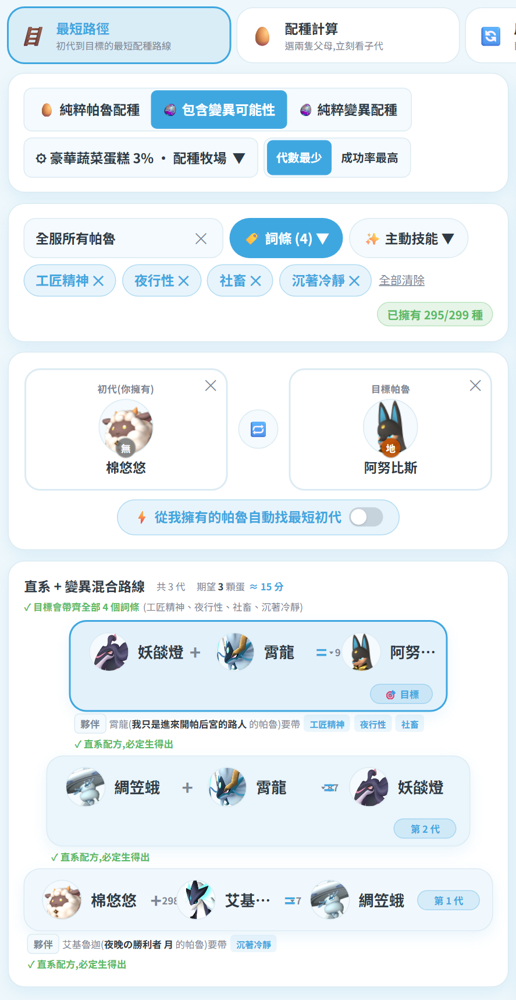
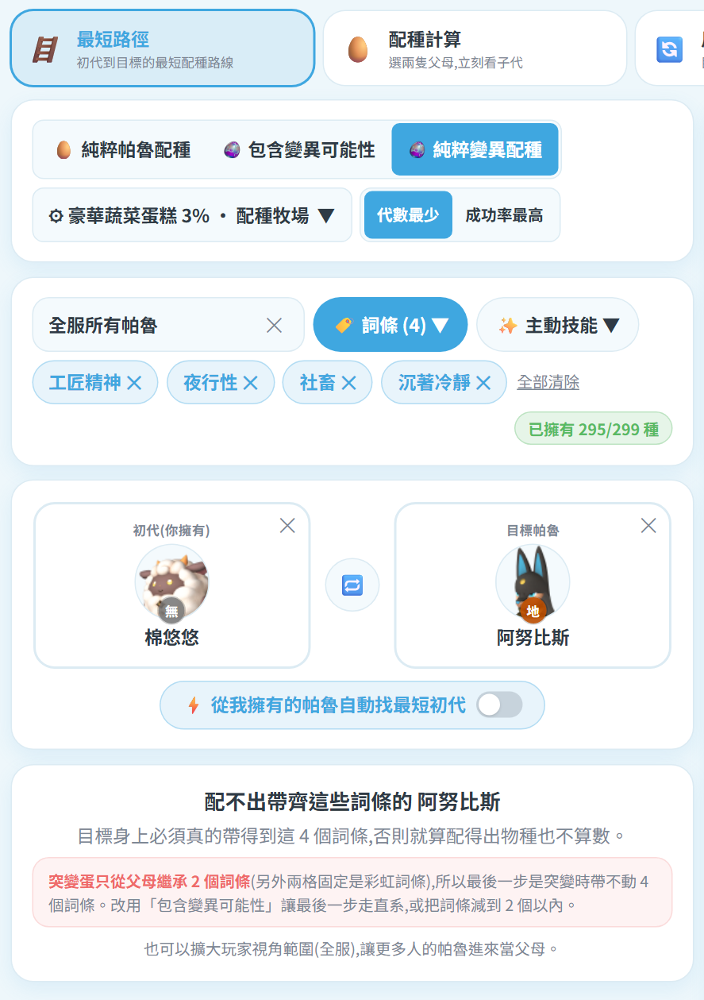

# 🧬 變異配種(突變)

「🥚 配種表 → 🪜 最短路徑」裡除了直系配方,還能走**突變**。
這頁說明機制、我們用的公式、以及驗證方式。

## 突變是什麼

官方 1.0 更新新增的要素:配種時有低機率生出**突變蛋**,孵出來的帕魯與正常配方的結果**完全不同物種**,而且必定帶:

| 突變帕魯固定帶 |
|---|
| 潛力值 90–100 |
| 首領帕魯 |
| 2 星濃縮 |
| 2–4 個彩虹被動技能 |
| 高等級技能 |
| 工作適應性 +2 |

另有 5 個**突變專屬彩虹詞條**:不死之身、特殊體質、寶寶保母、重裝甲、凌空微步
(也可以用耗材植入體在帕魯手術台取得)。

## 觸發機率(官方更新說明)

| 蛋糕 | 突變機率 | 備註 |
|---|---|---|
| 蘑菇蛋糕 | **1%** | 潛力值較易上升 |
| 蔬菜蛋糕 | **2%** | 一次產兩顆蛋 |
| 豪華蔬菜蛋糕 | **3%** | 最易突變,潛力值也易上升 |

## 產蛋速度(社群碼表實測)

| 設施 | 一般 | 有滿星梁葉龍或寶寶保母 |
|---|---|---|
| 配種牧場 | 5 分/顆 | 3 分 20 秒/顆 |
| 古代文明配種牧場 | 11 秒/顆 | 7 秒/顆 |

> 梁葉龍與寶寶保母的產蛋加成**不可疊加**,取高者。想大量刷突變,古代文明配種牧場快得多。

## 誰能被突變出來?

不是每隻都行。遊戲內有一份**限制列表**(只能自體繁殖、高塔、突襲帕魯都在上面),
實際可由突變產出的是 **143 / 299 隻**。所以在「純粹變異配種」模式下,
右側帕魯清單會自動只剩這 143 隻,選不到配不出來的目標。

被排除的例子:傑諾多蘭、貝菈露潔、波魯傑克斯、荷魯斯、異構格里芬,以及棉悠悠等低階帕魯。

## 公式

每隻帕魯有一個 **CombiRank(繁殖值)**,數字越小代表越高階(枯星龍 10 ~ 史萊姆 3100)。
突變的結果落在一段由父母決定的區間內:

```
min = 較強親代的 CombiRank(數字小)   max = 較弱親代的 CombiRank
候選區間  L = ⌊0.1 × min + 0.4 × max⌋ + 1
          H = ⌊0.2 × min + 0.4 × max⌋
```

區間內每一個整數值都對應到「涵蓋該值的可突變帕魯」,
**某隻帕魯的機率 = 它涵蓋的值數 ÷ 區間總值數**(這是「已經是突變蛋」的條件機率)。

兩隻同種配種時退化成 `[0.5r, 0.6r]`,正好對上實測值。

### 每顆蛋的實際機率

```
每顆蛋成功率 = 突變觸發率 × 該帕魯的條件機率
平均要幾顆蛋 = 1 ÷ 每顆蛋成功率
```

例:豪華蔬菜蛋糕(3%)配出條件機率 20.8% 的目標 → 每顆蛋 0.63%,平均約 160 顆蛋。

## 驗證

- **CombiRank** 與 [paldb.cc](https://paldb.cc/tw/Breeding_Farm#BreedCombi) 的 Combi 表逐項比對一致,並與 [tylercamp/palcalc](https://github.com/tylercamp/palcalc) 的 BreedingPower 交叉核對。
- **公式** 對 paldb 全部 143 個可突變目標、共 **495,068 筆**組合做全量回歸:
  **495,068 / 495,068(100.00%)與 paldb 完全相同**,143 個目標無一例外。
- 每隻帕魯的實際涵蓋區間是從這批實測資料反推後直接落地(邊界的平手歸屬因帕魯而異,無法用單一規則推得)。

> 遊戲未公開內部表,站上顯示的數字一律標示為「估算」。

## 三種配種來源


| 模式 | 說明 |
|---|---|
| **純粹帕魯配種** | 只走官方配方表,100% 生得出來 |
| **包含變異可能性** | 直系與突變都能用,優先代數少 |
| **純粹變異配種** | 全程靠突變蛋 |

梯度上每一步都會標明:

- **直系** → 綠字「直系配方,必定生得出」
- **變異** → 變異圖示 + 突變時中獎率 + 每顆蛋機率 + 平均顆數 + 換算時間

## 兩種挑路線的策略

| 策略 | 作法 |
|---|---|
| **代數最少** | 優先用最少代數到達目標 |
| **成功率最高** | 改挑期望蛋數最少的走法 |

實例(棉悠悠 → 阿努比斯,純變異):


| 策略 | 代數 | 期望蛋數 | 時間(古代配種器) |
|---|---|---|---|
| 代數最少 | 3 代 | 230 顆 | ≈ 19.2 小時 |
| 成功率最高 | 4 代 | **167 顆** | **≈ 13.9 小時** |

多繞一代,把最後一步從 20.4% 換成 50% 的突變,反而省了 63 顆蛋。


## 操作重點

1. 先選**目標帕魯** → 系統立刻列出**哪些帕魯能當初代**(附代數與成功率,你擁有的排前面)
2. 選初代後看梯度;梯度最底列的初代**可以直接點開更換**,整條路線即時重算
3. 每一步的**夥伴也能點開更換**,清單會標明各夥伴是「直系 100%」還是「變異 x%」
4. ⚙ 設定鈕可調蛋糕、產蛋設施與加成,所有時間估算跟著變


⚙ 設定鈕本身就是目前設定的摘要;突變的固定加成與 5 個彩虹詞條也收在同一個面板的
「突變帕魯會拿到什麼?」裡,平常不佔畫面。


## 詞條也能一起帶

變異模式同樣吃 🏷️ 詞條 / ✨ 主動技能 篩選,而且**詞條是硬條件**:
只有能把選定詞條全部送到目標身上的路線才算數,標題永遠是 `✓ 目標會帶齊全部 N 個詞條`。

初代候選會限縮成「**全服中真的有人擁有、且帶得動所需詞條**」的帕魯,
每一列並標出那隻帶詞條的帕魯是**誰的**(例:`夥伴 霄龍(阿東 的帕魯)要帶 夜行性 社畜`)。



### 突變一次只帶得動 2 個詞條

突變蛋的四格被動固定有兩格是彩虹詞條,**只剩兩格繼承父母**
(巴哈整理:「突變必定自帶 2 個虹詞,然後再從父母身上繼承兩個詞條」)。

| 模式 | 選 1–2 個詞條 | 選 3–4 個詞條 |
|---|---|---|
| 包含變異可能性 | ✅ | ✅ 最後一步走直系即可 |
| 純粹變異配種 | ✅ | ❌ 必定無解,畫面會直接說配不出來 |



完整說明見 [[網站-詞條篩選配種]]。

## 資料來源

- [paldb.cc — Breeding Farm / Mutation](https://paldb.cc/tw/Breeding_Farm#BreedCombi)
- [巴哈姆特:帕魯 1.0 突變情報整理](https://forum.gamer.com.tw/C.php?bsn=71458&snA=4671)
- [tylercamp/palcalc](https://github.com/tylercamp/palcalc)(MIT)
