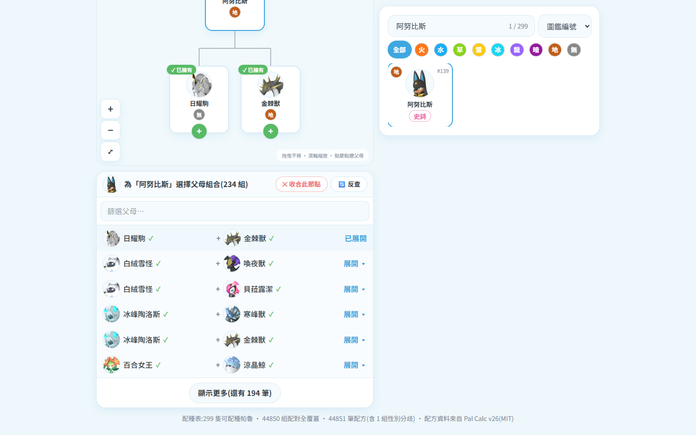
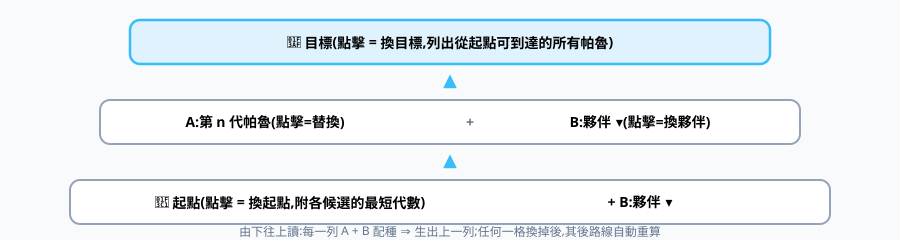
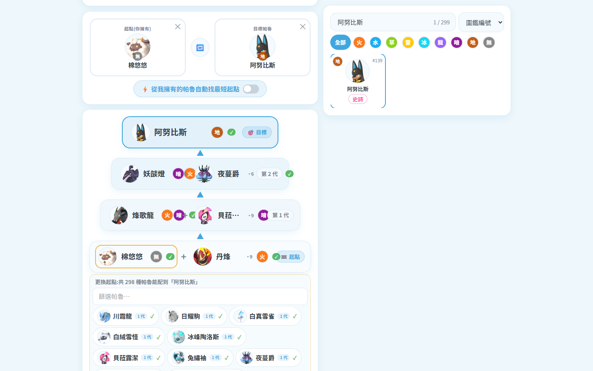

# 🥚 配種表(招牌功能)

資料:**299 隻可配種帕魯 × 44,851 筆配方(全組合覆蓋)**,來源 palcalc(MIT)。
三種模式左上切換;**右側欄永遠是帕魯清單**(搜尋 + 屬性過濾 + 圖鑑/名稱/稀有度排序),點卡片填入作用中欄位。

## 模式一:配種計算(A + B = 子代)

- 點「父母一」(藍框=作用中)→ 點右側卡片 → 自動跳「父母二」→ 結果即時出現
- 性別分歧特例(妮姆芙×芙蕾雅)會同時列出兩種結果
- **➕ 新增一組父母**可同時比較多組;第一組 ✕=清空,其餘 ✕=刪除
- 結果下方一鍵「🔄 反查」「🌳 配種樹」

## 模式二:反查組合(子代 → 父母)

- **作為子代 (N)**:所有能生出目標的父母組合(可篩選)
- **作為父母 (N)**:目標 × 全部夥伴各生出什麼
- 列表內每隻帕魯都可點擊繼續跳查

## 模式三:帕魯配種樹

### 🌳 樹狀配種

- 點右側清單選目標 → 樹頂 👑 出現;點任一節點 → 下方面板列出它的父母組合(擁有優先排序)→ 點組合往下展開,可無限延伸
- 節點 ✕ 收合;畫布**拖曳平移、滾輪縮放**、+/−/⤢ 按鈕
- 跳去反查再回來,**整棵樹會保留**

### 玩家視角

右上下拉選「全部帕魯種類 / 全服所有帕魯 / 某玩家」(可打字過濾):

- 節點標記 **✓已擁有**;**缺的帕魯灰階顯示**
- 頂部總結「✓ 已擁有 N 種 / ❗還缺 M 種」,缺的列成可點 chips;素材全齊顯示 🎉

### 🪜 最短路徑

- 自動算最少代數(BFS 全配方圖);由下往上讀,每列 **A + B ⇒ 上一列**
- **全部可點擊抽換**:
  - 點 **B(夥伴)** → 內嵌選單換夥伴(可搜尋):
  - 點 **A(中間代)** → 列出「維持總代數」的替代帕魯,選了之後**其後路線自動重算**(↩ 還原路線可復原)
  - 點 **起點** → 列出所有能配到目標的起點(附各自代數,= 到此目標的全部可能性):
  - 點 **目標** → 列出從起點可到達的所有帕魯
- **⚡ 自動找最短起點**開關:從你擁有的帕魯挑最短;關閉會還原手動選擇
- 起點欄位作用中時,右側清單自動過濾成「真的能配到目標」的帕魯
- 26 隻只能同種配種的傳說帕魯會明確提示「請直接捕捉」
