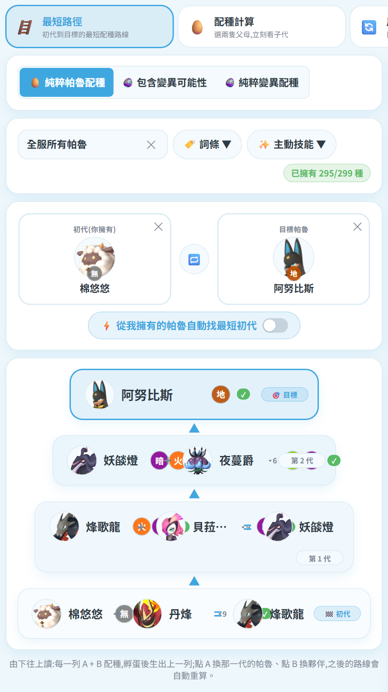
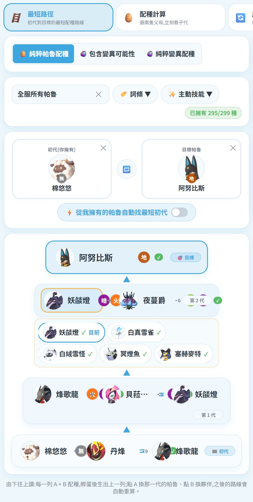
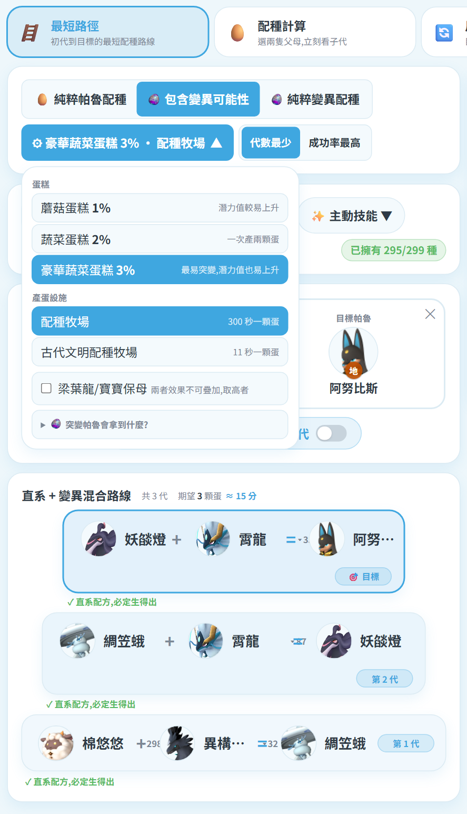
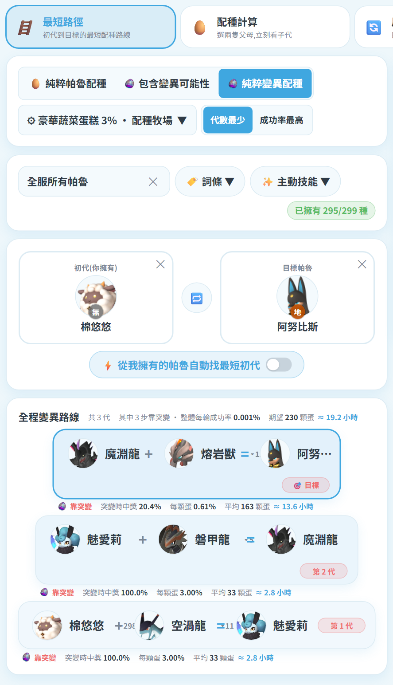
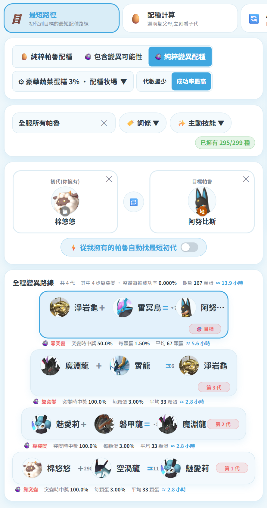
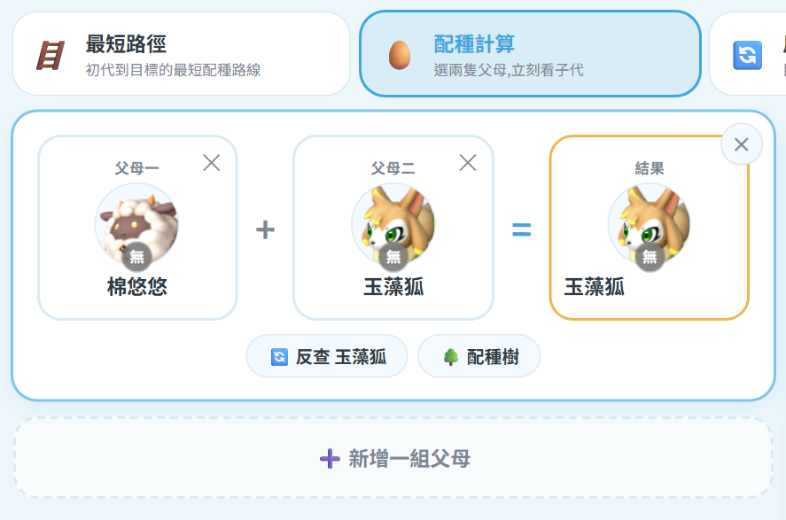
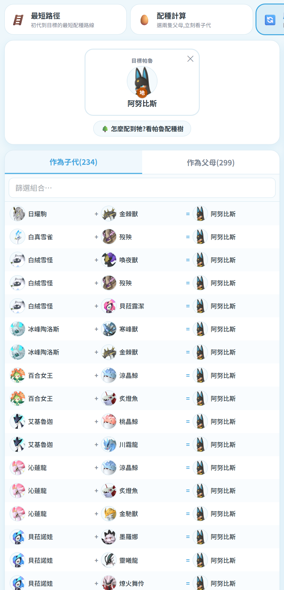
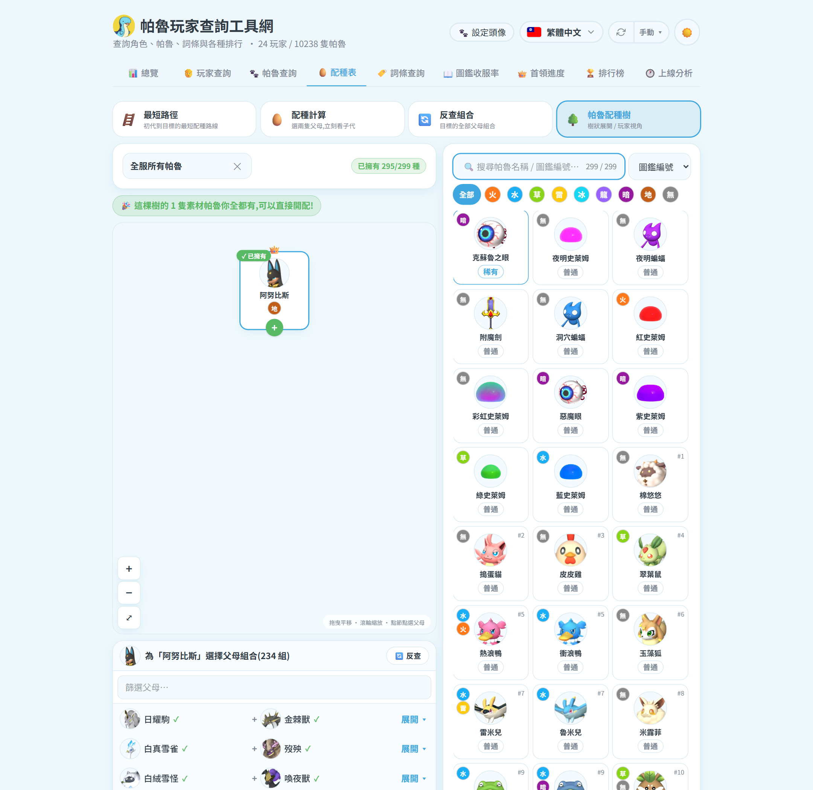

# 🥚 配種表(招牌功能)

資料:**299 隻可配種帕魯 × 44,851 筆配方(全組合覆蓋)**,來源 [palcalc](https://github.com/tylercamp/palcalc)(MIT);
變異資料另外校正自 [paldb.cc](https://paldb.cc/tw/Breeding_Farm#BreedCombi)(見 [[網站-變異配種]])。

上排四張卡片各是一種找法,**右側欄永遠是帕魯清單**(搜尋 + 屬性過濾 + 圖鑑/名稱/稀有度排序),點卡片就填入目前作用中的欄位。

---

## 🪜 最短路徑

選「初代」與「目標」,列出一路配到目標的每一代,每列都是完整的 **`A ＋ B ＝ C`**,
右端標明是第幾代(🏁 初代 / 第 N 代 / 🎯 目標)。

### 選完目標,它會告訴你誰能當初代

這是最常被問的地方:選好目標後,不必自己一隻隻試 ——
系統會直接列出**所有能配到這個目標的帕魯**,附各自要幾代,你擁有的排前面並標 ✓。
右側帕魯清單也會同步只剩這些(計數器會從 299 降下來)。

### 每一步都能換

| 點哪裡 | 會怎樣 |
|---|---|
| **A(上一代)** | 最底列 = 初代,點開可換成其他能到達目標的帕魯,整條路線重算 |
| **B(夥伴)** | 列出這一步的所有作法:**直系 100%** 或 **變異 + 機率**,選了就換 |
| **中間代** | 開啟替換面板,換掉這一代後自動重算後續 |
| **🎯 目標列** | 換一隻目標 |

### 三種配種來源

| 模式 | 說明 |
|---|---|
| **純粹帕魯配種** | 只走官方配方表,100% 生得出來 |
| **包含變異可能性** | 直系與突變都能用,優先代數少 |
| **純粹變異配種** | 全程靠突變蛋 |

選了後兩者會多出 **⚙ 設定鈕**,把蛋糕、產蛋設施與加成收在一起,
按鈕本身就是目前設定的摘要;突變的固定加成與彩虹詞條也收在裡面。

### 兩種挑路線的策略

| 策略 | 作法 |
|---|---|
| **代數最少** | 優先用最少代數到達目標 |
| **成功率最高** | 改挑期望蛋數最少的走法 |

同一組(棉悠悠 → 阿努比斯,純變異)的差別很大:

| | 代數最少 | 成功率最高 |
|---|---|---|
| 代數 | 3 代 | 4 代 |
| 期望蛋數 | 230 顆 | **167 顆** |
| 時間 | ≈ 19.2 小時 | **≈ 13.9 小時** |

多繞一代、把最後一步從 20.4% 換成 50% 的突變,反而省了 63 顆蛋:

詳細機制與驗證見 [[網站-變異配種]]。

### 詞條篩選

按 **🏷️ 詞條** 或 **✨ 主動技能** 可複選(合計最多 4 個),
每個選項標著範圍內有幾隻帶著它;**劃線反灰**代表帶這個詞條的帕魯都配不到目標。

系統會用現有的帕魯排列組合,找出把詞條全部帶到目標的路線,
每列標出**雙親各自帶了哪些詞條、以及那隻是誰的**。

在變異模式下詞條篩選一樣有效:因為詞條只能從初代帶上去,
初代候選會限縮成「你擁有、且帶該詞條」的物種,標題也會誠實標示這條路線**帶得到幾個詞條**。
完整說明見 [[網站-詞條篩選配種]]。

---

## 🥚 配種計算(A + B = 子代)

隨手選兩隻看生出什麼,可用 **➕ 新增一組父母**同時比較多組。

- 點「父母一」(藍框=作用中)→ 點右側卡片 → 自動跳「父母二」→ 結果即時出現
- 性別分歧特例(妮姆芙 × 芙蕾雅)會同時列出兩種結果
- 第一組的 ✕ = 清空,其餘 ✕ = 刪除
- 結果下方可一鍵跳「🔄 反查」或「🌳 配種樹」

## 🔄 反查組合(子代 → 父母)

- **作為子代 (N)**:所有能生出目標的父母組合
- **作為父母 (N)**:目標 × 全部夥伴各生出什麼
- 兩個分頁都可搜尋過濾,清單很長時分批載入

## 🌳 帕魯配種樹

點帕魯直接長樹(目標放樹頂 👑),點節點展開父母組合;
可拖曳平移、滾輪縮放,**玩家沒有的帕魯顯示灰階頭像**,下方並列出缺哪幾隻。

## 👀 玩家視角

左上的下拉切換統計範圍,四種模式共用:

| 選項 | 意義 |
|---|---|
| **全部帕魯種類** | 不看誰有,純看理論可行性(299 種) |
| **全服所有帕魯** | 用整個伺服器擁有的帕魯 |
| **某位玩家** | 只用那位玩家的帕魯,規劃自己配得出來的路線 |

啟用後會顯示「已擁有 N/299 種」,梯度上缺的帕魯會標示出來。

## 📌 小提醒

- 配種表是**純靜態查表**,不需要存檔資料也能用;玩家視角與詞條篩選才會用到存檔。
- 顯示「{name} 無法透過其他物種配種取得」代表牠只能同種自交(共 26 隻),請直接捕捉一對。
- 遊戲改版後要更新配方,見主 README 的「🔄 遊戲改版後更新配種資料」。
