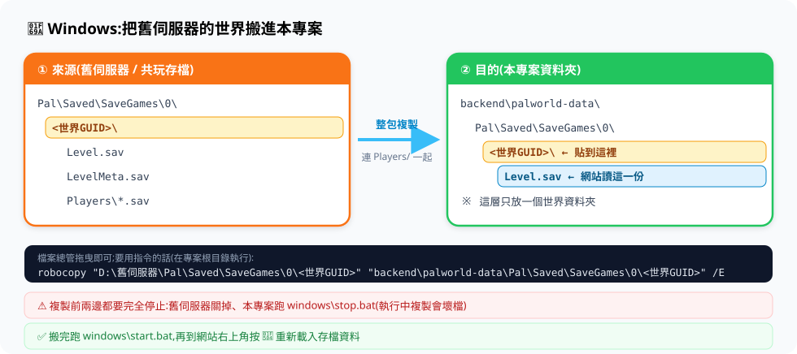

# Windows 使用者

雙擊即可,不需要打指令。

| 檔案 | 用途 |
|---|---|
| `start.bat` | **一鍵啟動** —— 首次會自動產生設定檔與隨機密碼,然後啟動全部服務 |
| `restart.bat` | 重新啟動全部服務(改完設定用這個) |
| `stop.bat` | 停止全部服務(存檔會保留) |
| `status.bat` | 查看目前狀態與連線資訊 |
| `setup.ps1` | 產生 `.env` 與 `backend/config.json`(由 `start.bat` 自動呼叫,通常不用自己執行) |

啟動後:

- 查詢網站 <http://localhost>
- 遊戲連線 `你的IP:8211`

## 🚚 已經有伺服器?把存檔搬過來



本專案只讀一個位置:`backend\palworld-data\`。
所謂「搬家」就是把舊伺服器的**世界資料夾**(名字是一長串 GUID)整包複製過去。

### 0. 系統是讀哪個檔案?

查詢網站上的**玩家、帕魯、公會與據點,全部來自同一個檔**:

```text
backend\palworld-data\Pal\Saved\SaveGames\0\<世界GUID>\Level.sav
```

要怎麼在多個世界資料夾中挑到「就是它」,規則是:

1. 先讀 `backend\palworld-data\Pal\Saved\Config\LinuxServer\GameUserSettings.ini` 的
   `DedicatedServerName=`,用它指到的資料夾找 `Level.sav`
2. 找不到才退而求其次:挑 `SaveGames\0\` 底下**最後修改時間最新**的那份 `Level.sav`

> 所以只要 `Level.sav` 搬對位置,網站就讀得到 —— 不需要動資料庫,也沒有匯入步驟。
> 解析結果會依 `Level.sav` 的修改時間快取,存檔沒變就不重解;
> 存檔更新後在網站右上角按 🔄 就會重新讀取(公會/據點另有一份低頻背景快取,可能慢一輪)。

### 1. 先找到舊存檔在哪

| 來源 | 世界資料夾位置 |
|---|---|
| 其他 Windows 專用伺服器 | `PalServer\Pal\Saved\SaveGames\0\<世界GUID>` |
| 其他 Linux / Docker 伺服器 | 掛載目錄底下的同一層 |
| **本機共玩存檔(4 人邀請碼)** | `%LOCALAPPDATA%\Pal\Saved\SaveGames\<SteamID>\<世界GUID>` |
| 本專案的 SteamCMD 版 | `windows\native\server\Pal\Saved\SaveGames\0\<世界GUID>` |

> 在檔案總管網址列直接貼 `%LOCALAPPDATA%\Pal\Saved\SaveGames` 就會跳到共玩存檔。
> 資料夾裡要有 `Level.sav` 與 `Players\` 才是對的那一個;玩過的世界通常幾十 MB 起跳,
> 只有幾百 KB 的多半是沒玩過的空世界。

### 2. 兩邊都停下來

```bat
windows\stop.bat
```

舊伺服器也要關掉(共玩存檔 = 關閉遊戲)。**執行中複製會壞檔**,這是最常見的搬家失敗原因。

### 3. 整包複製

用檔案總管把整個 `<世界GUID>` 資料夾拖進去:

```text
backend\palworld-data\Pal\Saved\SaveGames\0\
```

或用指令(在專案根目錄執行):

```bat
robocopy "D:\舊伺服器\Pal\Saved\SaveGames\0\<世界GUID>" "backend\palworld-data\Pal\Saved\SaveGames\0\<世界GUID>" /E
```

⚠️ **`SaveGames\0\` 底下只放一個世界資料夾**;放兩個以上,伺服器可能載入到不是你要的那個。
也**不要**把舊伺服器的 `GameUserSettings.ini` 整檔複製過來(裡面夾帶舊 IP 與 RCON 設定)。

### 4. 啟動並確認

```bat
windows\start.bat
```

開 <http://localhost> → 右上角按 🔄 重新載入 → 看得到大家的帕魯就成功了。

### 搬完卻是「全新世界」?

伺服器是靠 `Config\...\GameUserSettings.ini` 裡的 `DedicatedServerName=` 決定載入哪個世界,
不是看到資料夾就載入。把它改成你的 GUID 資料夾名再重啟即可。

**本機共玩存檔**還有一個特例:主機本人的角色綁在通用 ID,搬到專用伺服器後要用
[palworld-host-save-fix](https://github.com/xNul/palworld-host-save-fix) 修復
(其他成員直接登入就是原本的角色)。執行前先備份整個世界資料夾。

完整說明(含存檔結構圖與檢查清單)→
[Wiki:存檔搬家](https://github.com/daniel840711/palserver-tools/wiki/%E5%AD%98%E6%AA%94%E6%90%AC%E5%AE%B6)

## 沒有 Docker?用 SteamCMD 版

`windows\native\` 裡是 **SteamCMD 版** —— 不需要 Docker,用 SteamCMD 直接把伺服器裝在本機,
但**只有遊戲伺服器**,沒有查詢網站與自動排程。詳見 [docs/SteamCMD版.md](../docs/SteamCMD版.md)。

## 常見狀況

- **跳出「找不到 Docker」** —— 先安裝並啟動 [Docker Desktop](https://www.docker.com/products/docker-desktop/)。
- **視窗一閃就關** —— 改成在資料夾空白處按右鍵 →「在終端中開啟」,再輸入 `windows\start.bat`,就看得到訊息。
- **想改伺服器參數** —— 編輯專案根目錄的 `.env`,再跑 `restart.bat`。
